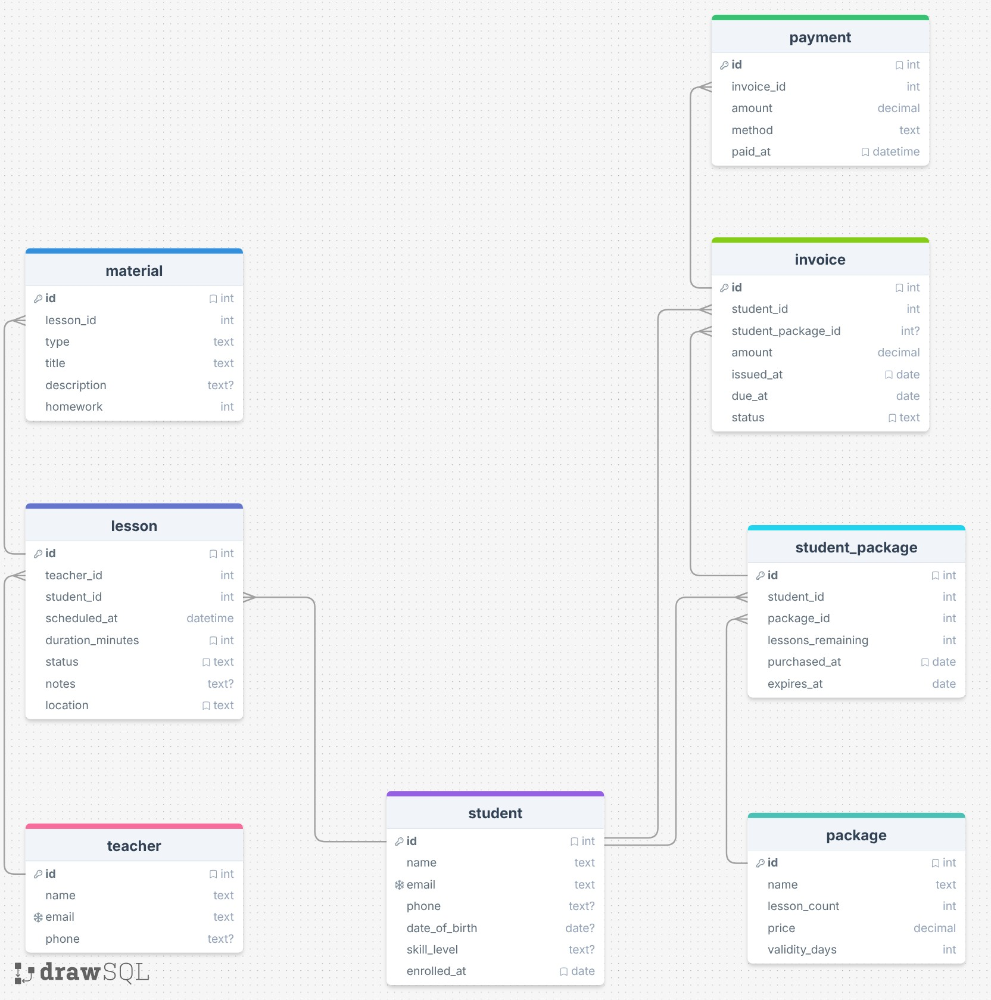

# natural-language-cs452

## Database

This project demonstrates a natural-language-to-SQL workflow for a simple "guitar teacher" database. `db_bot.py` takes natural language questions, has an LLM produce queries, executes those queries against a local database, and writes the responses.

My database models teachers, students, lessons, lesson packages, invoices, and payments.



## Instructions

1. Create a virtual environment and install dependencies:

```bash
python3 -m venv .venv
source .venv/bin/activate
pip install -r requirements.txt
```

2. Add an OpenAI API key to `config.json` (replace the placeholder value)

3. Run the bot:

```bash
python3 db_bot.py
```

## Example questions

- Example that worked well:

  "Which students have lessons scheduled in the next 7 days?"
  - This was a simple question that mapped the time-window to a WHERE on `scheduled_at` and `status = 'scheduled'`, then joined to `student`.

- Example that failed:

  "Which students have unpaid invoices and how much is outstanding for each?"
  - The LLM summed invoice amounts but did not subtract payments, so it reported full invoice totals rather than outstanding balances.

## Strategies tried and differences

- `zero_shot` - produced several correct queries, but still made mistakes on payment aggregation and datetime arithmetic in a few cases.

- `single_domain_double_shot` — Overall performed similarly to zero-shot, with the same core failures (payments not subtracted, incorrect overlap arithmetic).
